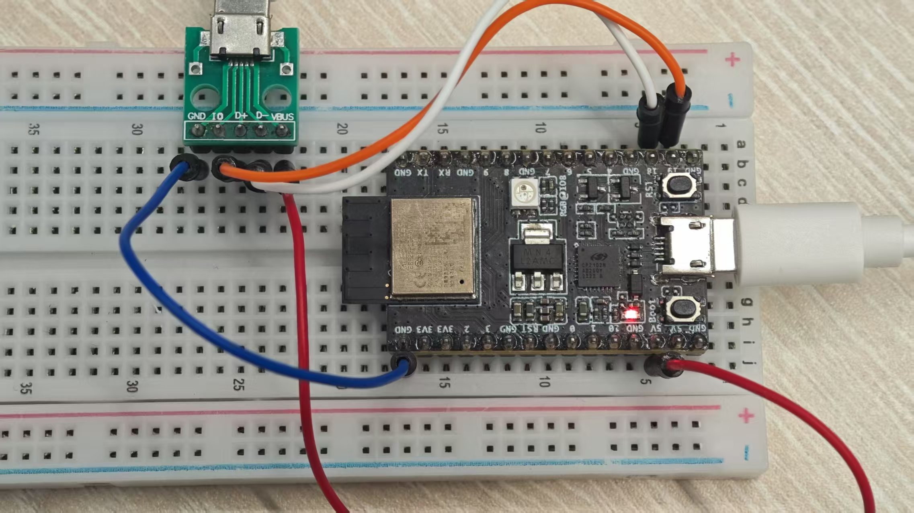

# "Hello, world!" example

## Building and running the example

1. Make sure you have a `riscv-none-elf-gcc` toolchain installed and added to PATH.
2. Build the example with CMake:
   ```bash
   cd examples/hello_world
   mkdir build
   cmake -B build -D target=esp32c3 -G Ninja .
   cmake --build build
   ```
   For other chip, please use the `target=chip_name`, where `chip_name` can be any from the supported ones.
   You should get the following output at the end:
   ```
   [2/3] Generating hello_world.bin
   copy from `hello_world' [elf32-littleriscv] to `hello_world.bin' [binary]
   [3/3] Running utility command for hello_world-size
   text	   data	    bss	    dec	    hex	filename
   5202	    132	    196	   5530	   159a	hello_world
   ```
   The following files will be generated:
   - `hello_world` — ELF output file
   - `hello_world.bin` — binary file for flashing into the chip
   - `hello_world.map` — linker map file
3. Flash the example using [esptool](https://pypi.org/project/esptool/):
   ```bash
   esptool.py --baud 921600 write_flash 0x0000 build/hello_world.bin
   ```
   (Adjust the serial port name as needed.)
4. See the serial output, for example using `miniterm.py` (assuming `pyserial` is installed):
   ```bash
   pyserial-miniterm /dev/ttyUSB0 115200
   ```
   You should see the following output:
   ```
   ESP-ROM:esp32c3-api1-20210207
   Build:Feb  7 2021
   rst:0x1 (POWERON),boot:0xc (SPI_FAST_FLASH_BOOT)
   Hello, world!
   ```
   The output will keep repeating with reset reasons such as `TG0WDT_SYS_RST`, `RTCWDT_RTC_RST` — this is because this example doesn't disable or feed the hardware watchdog timers.
5. JTAG Debugging
   **IMPORTANT**: this part is different from README.md in the root folder. Please refer to this one.
   You need a USB stub and connect to esp32c3 devkit.

   | USBSTUB | DEVKIT |
   |---------|--------|
   | GPIO18  | D-     |
   | GPIO19  | D+     |
   | VBUS    | 5V     |
   | GND     | GND    |

   
   Install esp-idf and run get_idf to set up IDF environment.
   Run OpenOCD
   ```bash
   openocd -c "set ESP_RTOS none" -f "board/esp32c3-builtin.cfg"
   ```
   open a new console and run GDB
   ```bash
   riscv-none-elf-gdb -x gdbinit build/hello_world
   ```
   Note that in gdbinit, we have set temporary hardware breakpoint (thb) to entry (at 0x42000008).
   ```bash
   thb *0x42000008
   ```
   GDB will stop at 0x42000008. If you want to add breakpoint, please use thb instead of b.
   ```bash
   thb main # to set breakpoint at main()
   ```
6. Check Assembly
   Even if you don't have a usb stub on your hand, you can easily check the machine code by:
   ```bash
   riscv-none-elf-objdump -S build/hello_world > build/hello_world.asm
   ```
   This will generate the assembly code with its source code in C.
